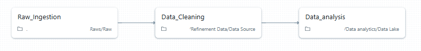

# Databricks Data Processing - NYC Yellow Trip

Desafio: Estruturar um pipeline de engenharia de dados no ambiente
Databricks, respeitando as boas práticas de arquitetura em camadas (Bronze, Prata e Gold), com
foco em confiabilidade, automação e análise de dados.

[Me acompanhe aqui! ](https://dbc-ef780d3c-c43c.cloud.databricks.com/editor/notebooks/943498958963772?o=609239402676531)
| [Descricao colunas](/notbooks/documentacao/descricao_colunas.md) | [Tipos de Usuario]() | 

---

## Etapas construidas

Primeiro criei um notbook Databricks para cada camada:

[Bronze](./notbooks/Raw.ipynb) → dados brutos, sem transformação
- Aqui coleto automaticamente apenas tabelas que contem o nome **yellow_tripdata_**, então se eu inserir uma nova tabela com esse nome de um novo mes será inserido automaticamente

[Silver](./notbooks/DataSource.ipynb) → limpeza, validação, padronização
- Além de armazenar dados limpos na tabela *yellow_trip_silver*, separei os dados incompletos ou invalidos na *yellow_trip_silver_invalid*.
Isso é importante pois além de rastrearmos possibilidades de performance com os dados limpos, os dados que identificamos como incorreto também pode nos trazer insights de qual é o causador.
 

Gold → tabelas analíticas e agregadas, prontas para BI, Dashboard e varias outras possibilidades
- Nessa camada é importante validar se o código dos calculos que está criando vai trazer o dado preciso. É muito fácil o dado arrendondar e perder o valor preciso.

Notbooks nas diferentes camadas no databricks: [Bronze](https://dbc-ef780d3c-c43c.cloud.databricks.com/editor/notebooks/2731816656921143?o=609239402676531) | [Silver](https://dbc-ef780d3c-c43c.cloud.databricks.com/editor/notebooks/2731816656921142?o=609239402676531) | [Gold](https://dbc-ef780d3c-c43c.cloud.databricks.com/editor/notebooks/3327772790411468?o=609239402676531)

> Essa divisão é importante no caso de grande volume de dados! Porque facilita a manutenção, otimiza, evita repitir dados, ganha rastreabilidade maior em caso de erros e permite disponibilizar os dados para diferentes tipos de consumidores.

### Próximo passo: Criando Jobs

O job implementa uma sequência de tasks que processam os dados em etapas, garantindo que a camada Bronze seja populada antes da Silver, e assim por diante. Essa estrutura de execução encadeada permite manter a consistência dos dados mesmo em larga escala, funcionando como uma pipeline dentro de um único job.

>Silver(_Data_Cleaning_) não vai rodar se Bronze(_Raw_ingestion_) não rodar. Exemplo, se rodasse Gold, independente das camadas anteriores, em um job especifico para camadas Gold ele traria dados desatualizados e inconsistentes.

Nessa estrutura também temos a facilidade de debugar e monitorar erros, exemplo:

> Sabemos que ocorreu na primeira camada, mais facil de encontrar o erro. Nesse caso, era erro de repositório.

### Detalhes do Job
**Agendamento:** diário, às 3h da manhã 
**Tipo:** Notbook 
**Source:** Workspace (Existe git também) 
**Compute:** Serverless  (No Databricks gratuíto, até então, não tem opção de modificar o Compute) 

---

## Consultando tabelas gold 

Nessa camada, além de ter os dados disponibilizado em formato tabela dentro do notbook, podendo exportar esses dados para outras plataformas (como fiz também), e automatizar para o Dashboard Databricks que a própria ferramenta disponibiliza.

Databricks Dashboard - [Clique aqui para ser direcionado para o dashboard](https://dbc-ef780d3c-c43c.cloud.databricks.com/dashboardsv3/01f08529308e1d409f4d70782e3b8d24/published?o=609239402676531)

Kaggle - [Clique aqui para ver o código](https://www.kaggle.com/code/giovanaalves/taxi-yellow)

Escolhi o Kaggle para compartilhar a visualização do Mapa de calor. 

Como se trata de um dado que pode ser transformado em coordenadas, você faz a conversão do nome/bairro que o proprio [nyc.gov](https://www.nyc.gov/site/tlc/about/tlc-trip-record-data.page) disponibiliza *(na tabela está como números na coluna PULocationID e DOLocationID, eles disponibilizam um arquivo excel, onde cada número corresponde a uma localização)*

Para fazer essa visualização exportei os dados da tabela Gold como csv, limitado a 1000 rows, e converti todos os números em cidade, e depois em Latitude e Longitude.

> Aqui podemos identificar onde se concentra maior número do local de inicio do trajeto.
